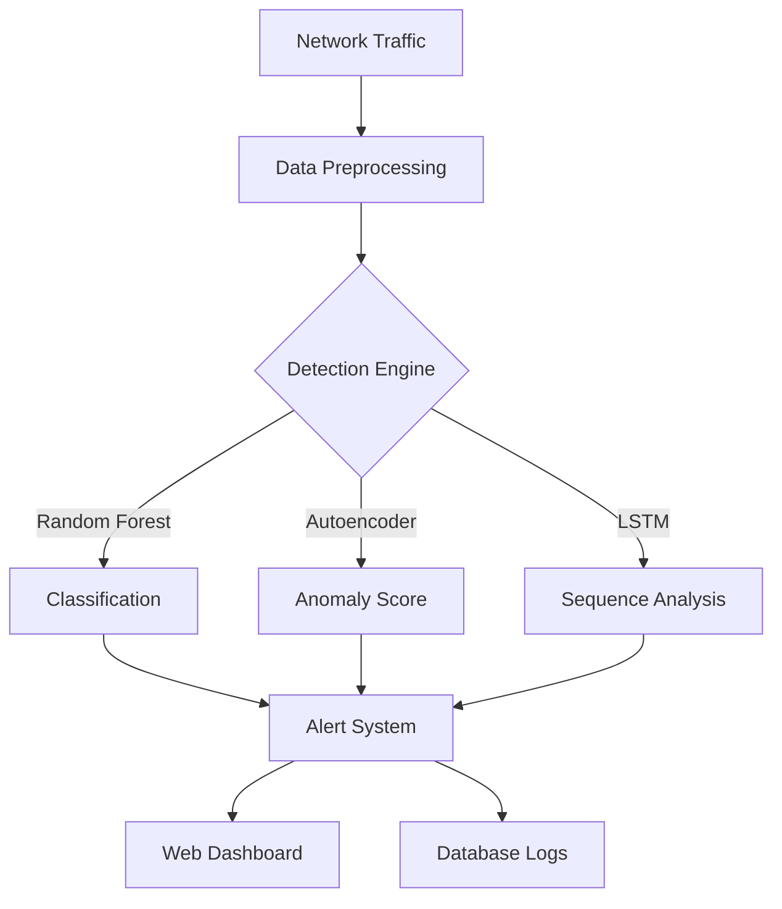

# AI-Powered Intrusion Detection System (IDS)

## Abstract
This project implements an intelligent Intrusion Detection System (IDS) capable of monitoring network traffic and detecting cyber-attacks in real-time. By leveraging three distinct Machine Learning algorithms—Random Forest, Autoencoders, and LSTM—the system provides a robust defense mechanism against various network threats including DDoS, Port Scanning, and Brute Force attacks. The solution features a comprehensive web-based dashboard for real-time monitoring and control.

## Objective
To develop a scalable, ML-driven security solution that outperforms traditional signature-based IDS by detecting novel and complex attack patterns through anomaly detection.

## Key Features
- **Multi-Model Detection**: Combines Random Forest (Classification), Autoencoder (Anomaly Detection), and LSTM (Sequence Analysis) for high accuracy.
- **Real-time Monitoring**: Live visualization of network traffic and alerts.
- **Interactive Dashboard**: Professional dark-mode GUI for security analysts.
- **Traffic Simulation**: Built-in module to generate synthetic attack traffic for testing.
- **Rest API**: Full JSON API for integration with other security tools.

## System Architecture



## Tech Stack
- **Frontend**: React, Recharts, Tailwind CSS, Framer Motion
- **Backend**: Node.js, Express, PostgreSQL
- **Machine Learning**: Python, Scikit-learn, TensorFlow/Keras, Pandas, NumPy
- **Database**: PostgreSQL (Drizzle ORM)

## ML Algorithms Used
1.  **Random Forest**: A robust ensemble method used for classifying known attack types based on feature signatures.
2.  **Autoencoder**: A deep learning model trained only on normal traffic to detect deviations (zero-day attacks) by measuring reconstruction error.
3.  **LSTM (Long Short-Term Memory)**: A recurrent neural network that analyzes the *sequence* of packets to detect time-based attacks like slow-loris DDoS.

## Dataset
The system is designed to work with the **NSL-KDD** dataset, a benchmark dataset for network intrusion detection. It includes features like duration, protocol type, service, flag, source bytes, and destination bytes.

## Installation & Run

1.  **Install Dependencies**:
    ```bash
    npm install
    pip install -r requirements.txt
    ```

2.  **Setup Database**:
    The system uses PostgreSQL. Ensure `DATABASE_URL` is set in your environment.
    ```bash
    npm run db:push
    ```

3.  **Train Models** (Optional - pre-trained models included/simulated):
    ```bash
    python python_src/training/train_models.py
    ```

4.  **Run Application**:
    ```bash
    npm run dev
    ```

5.  **Access Dashboard**:
    Open `http://0.0.0.0:5000` in your browser.

## Project Structure
- `python_src/`: Python source code for ML models.
  - `preprocessing/`: Data cleaning and feature extraction.
  - `training/`: Training scripts for RF, AE, and LSTM.
  - `detection/`: Inference engine.
- `server/`: Node.js backend server.
- `client/`: React frontend application.
- `shared/`: Shared types and database schema.

## Future Scope
- Integration with real packet capture (e.g., using `libpcap` or `scapy`).
- Deployment on edge devices.
- Federated learning for privacy-preserving model updates.

## Conclusion
This AI-Powered IDS demonstrates the effectiveness of combining hybrid ML approaches to secure network infrastructures against modern cyber threats.
